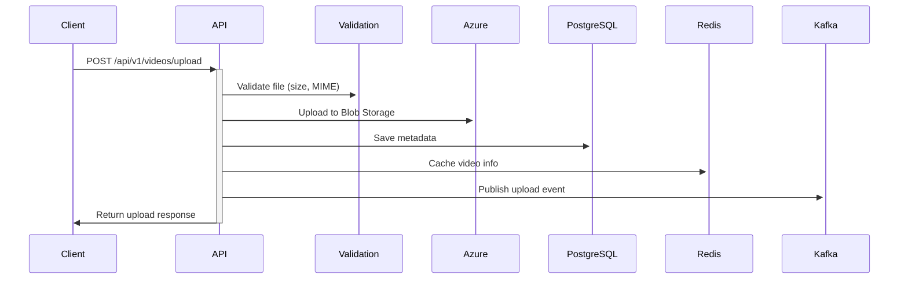
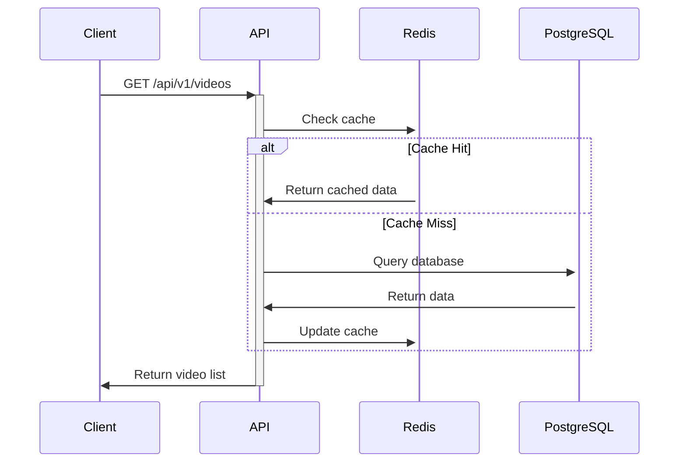

# Implementação Completa - Videos API

## 🎯 Resumo Executivo

Este documento apresenta a implementação completa da **Videos API**, uma aplicação Spring Boot robusta para upload e gerenciamento de vídeos com integração Azure Blob Storage, streaming de eventos Kafka e ambiente de desenvolvimento Docker completo.

> Importante: Todos os endpoints de negócio exigem o header `x-cliente-id`. As consultas, uploads e eventos são escopados por usuário.

## ✅ Funcionalidades Implementadas

### 1. **Upload de Vídeos**
- **Endpoint**: `POST /api/v1/videos/upload` (header: `x-cliente-id` obrigatório)
- **Funcionalidades**:
  - Upload de arquivos de vídeo (até 500MB)
  - Validação de tipo MIME usando Apache Tika
  - Formatos suportados: MP4, AVI, MOV, WMV, FLV, WebM, MKV
  - Armazenamento no Azure Blob Storage (com mock local)
  - Persistência de metadados no PostgreSQL
  - Cache no Redis para performance
  - Publicação de evento Kafka após upload bem-sucedido

### 2. **Listagem de Arquivos Processados**
- **Endpoints** (todos exigem `x-cliente-id`):
  - `GET /api/v1/videos` - Lista todos os vídeos
  - `GET /api/v1/videos/status/{status}` - Filtra por status
  - `GET /api/v1/videos/{id}` - Consulta vídeo específico
- **Informações Retornadas**:
  - ID do vídeo
  - Nome original do arquivo
  - Status de processamento (UPLOADED, PROCESSING, PROCESSED, FAILED)
  - Tamanho do arquivo
  - Link de download (disponível quando status = PROCESSED)
  - Timestamps de upload e processamento
- **Performance**: Cache Redis com TTL de 10 minutos

### 3. **Consumer Kafka para Atualizações de Status**
- **Tópico**: `video-status-update-events`
- **Funcionalidades**:
  - Escuta atualizações de status de processamento
  - Atualização automática no PostgreSQL
  - Atualização do cache Redis
  - Suporte a mock Redis para desenvolvimento local
  - Acknowledgment manual com retry automático
  - Logging detalhado para debug

## 🏗️ Arquitetura Implementada

### Stack Tecnológico
- **Java 21** com Spring Boot 3.3.5
- **PostgreSQL 16** como banco de dados principal
- **Redis 7** para cache distribuído
- **Apache Kafka** para streaming de eventos
- **Azure Blob Storage** com mock Azurite
- **Docker & Docker Compose** para ambiente de desenvolvimento

### Padrões Arquiteturais
- **Arquitetura Limpa** com separação clara de responsabilidades
- **Domain-Driven Design** com entidades bem definidas
- **CQRS** para separação de comandos e consultas
- **Event-Driven Architecture** com Kafka
- **Cache-Aside Pattern** com Redis

### Estrutura de Diretórios
```
src/main/java/br/com/fiap/videosapi/
├── core/
│   ├── config/             # Configurações (Redis, Kafka, Development)
│   └── exception/          # Tratamento global de exceções
├── video/
│   ├── application/        # Casos de uso e serviços
│   │   ├── usecase/        # Interfaces dos casos de uso
│   │   ├── service/        # Serviços de aplicação (Cache)
│   │   └── impl/           # Implementações dos casos de uso
│   ├── domain/             # Entidades e objetos de domínio
│   │   └── entity/         # Video, VideoStatus
│   ├── infrastructure/     # Integrações externas
│   │   ├── azure/          # Azure Blob Storage (real + mock)
│   │   ├── kafka/          # Produtores e consumidores Kafka
│   │   ├── repository/     # Persistência JPA
│   │   └── controller/     # Controllers REST
│   └── common/             # DTOs e eventos compartilhados
│       └── domain/dto/     # Request/Response DTOs e Events
```

## 🔄 Fluxo de Processamento

### 1. Upload de Vídeo


### 2. Processamento de Status
```mermaid
sequenceDiagram
    External->>+Kafka: Publish status update
    Consumer->>+Kafka: Consume status event
    Consumer->>+PostgreSQL: Update video status
    Consumer->>+Redis: Update cache
    Consumer->>-Kafka: Acknowledge message
```

### 3. Consulta de Vídeos


## 🐳 Ambiente de Desenvolvimento

### Serviços Docker
| Serviço | Porta | Descrição |
|---------|-------|-----------|
| PostgreSQL | 5432 | Banco de dados principal |
| Redis | 6379 | Cache distribuído |
| Kafka | 9092 | Message broker |
| Zookeeper | 2181 | Coordenação Kafka |
| Kafka UI | 8081 | Interface web do Kafka |
| Azurite | 10000-10002 | Mock Azure Blob Storage |
| API | 8080 | Aplicação Spring Boot |

### Scripts de Gerenciamento
- `./scripts/dev-setup.sh` - Inicializa ambiente completo
- `./scripts/dev-stop.sh` - Para todos os serviços
- `./scripts/dev-clean.sh` - Remove volumes e limpa ambiente

### Configurações de Perfil
- **`local`**: Mocks habilitados (Azure + Kafka via Redis)
- **`dev`**: Serviços externos reais
- **`prod`**: Configuração de produção

## 📊 Banco de Dados

### Tabela `videos`
```sql
CREATE TABLE videos (
    id BIGSERIAL PRIMARY KEY,
    original_file_name VARCHAR(255) NOT NULL,
    stored_file_name VARCHAR(255) NOT NULL,
    content_type VARCHAR(100) NOT NULL,
    file_size BIGINT NOT NULL,
    azure_blob_url TEXT NOT NULL,
    container_name VARCHAR(100) NOT NULL,
    status VARCHAR(20) NOT NULL DEFAULT 'UPLOADED',
    uploaded_at TIMESTAMP NOT NULL DEFAULT CURRENT_TIMESTAMP,
    processed_at TIMESTAMP,
    created_at TIMESTAMP NOT NULL DEFAULT CURRENT_TIMESTAMP,
    updated_at TIMESTAMP NOT NULL DEFAULT CURRENT_TIMESTAMP
);
```

### Índices Otimizados
- `idx_videos_status` - Consultas por status
- `idx_videos_uploaded_at` - Ordenação temporal
- `idx_videos_stored_file_name` - Busca por arquivo
- `idx_videos_processed_at` - Consultas de processamento

### Constraints de Integridade
- Status válidos: UPLOADED, PROCESSING, PROCESSED, FAILED
- Tamanho de arquivo > 0
- processed_at obrigatório quando status = PROCESSED

## 🔄 Tópicos Kafka

### `video-upload-events`
**Publicado após upload bem-sucedido**
```json
{
  "videoId": 1,
  "originalFileName": "video.mp4",
  "storedFileName": "uuid-video.mp4",
  "contentType": "video/mp4",
  "fileSize": 1048576,
  "azureBlobUrl": "https://storage.blob.core.windows.net/videos/uuid-video.mp4",
  "containerName": "videos",
  "userId": "user-123",
  "status": "UPLOADED",
  "uploadedAt": "2025-09-06T10:44:00",
  "eventType": "VIDEO_UPLOAD_SUCCESS"
}
```

### `video-status-update-events`
**Consumido para atualizações de status**
```json
{
  "videoId": 1,
  "previousStatus": "UPLOADED",
  "newStatus": "PROCESSING",
  "message": "Video processing started",
  "processedBy": "video-processor-service",
  "userId": "user-123",
  "timestamp": "2025-09-06T10:45:00"
}
```

## 📊 Cache Redis

### Estrutura de Chaves
```
video:{id}              # Objeto completo do vídeo (TTL: 10min)
video:status:{id}       # Status específico (TTL: 10min)
videos:all              # Lista de todos os vídeos (TTL: 10min)
videos:status_{status}  # Lista filtrada por status (TTL: 10min)
```

### Estratégia de Cache
- **Cache-Aside Pattern**: Aplicação gerencia cache
- **TTL**: 10 minutos para dados da aplicação
- **Eviction**: Automática em atualizações
- **Serialização**: JSON via Jackson

## 🧪 Mocks para Desenvolvimento

### MockAzureBlobStorageService
- **Ativação**: `azure.storage.mock.enabled=true`
- **Armazenamento**: `/tmp/mock-azure-storage/`
- **URLs**: `http://localhost:8080/mock-storage/{filename}`

### MockVideoEventProducer
- **Ativação**: `kafka.mock.enabled=true`
- **Armazenamento**: Redis com TTL de 1 hora
- **Canais**: `video-upload-events`, `video-status-update-events`

## 🎯 Endpoints da API

### Upload de Vídeo
```http
POST /api/v1/videos/upload
Content-Type: multipart/form-data
x-cliente-id: <seu_user_id>

Body: file (video file, max 500MB)

Response 201:
{
  "id": 1,
  "originalFileName": "video.mp4",
  "storedFileName": "uuid-video.mp4",
  "contentType": "video/mp4",
  "fileSize": 1048576,
  "azureBlobUrl": "https://...",
  "status": "UPLOADED",
  "uploadedAt": "2025-09-06T10:44:00",
  "message": "Video uploaded successfully"
}
```

### Listar Todos os Vídeos
```http
GET /api/v1/videos
x-cliente-id: <seu_user_id>

Response 200:
[
  {
    "id": 1,
    "originalFileName": "video.mp4",
    "status": "PROCESSED",
    "fileSize": 1048576,
    "downloadUrl": "https://...",
    "uploadedAt": "2025-09-06T10:44:00",
    "processedAt": "2025-09-06T10:45:00"
  }
]
```

### Listar por Status
```http
GET /api/v1/videos/status/{status}
# status: UPLOADED, PROCESSING, PROCESSED, FAILED
x-cliente-id: <seu_user_id>

Response 200: [array of videos]
```

### Consultar Vídeo Específico
```http
GET /api/v1/videos/{id}
x-cliente-id: <seu_user_id>

Response 200: {video object}
Response 404: Video not found
```

## 🔧 Configuração e Execução

### Pré-requisitos
- Docker e Docker Compose
- Java 21
- Maven 3.8+
- IDE com suporte Lombok

### Setup Rápido
```bash
# 1. Iniciar ambiente
./scripts/dev-setup.sh

# 2. Configurar IDE (IntelliJ)
# - Instalar plugin Lombok
# - Habilitar annotation processing
# - Configurar JDK 21

# 3. Executar aplicação
export SPRING_PROFILES_ACTIVE=local
# Executar VideosApiApplication na IDE

# 4. Verificar funcionamento
curl http://localhost:8080/actuator/health
```

### Teste Completo
```bash
# Upload de vídeo
curl -X POST http://localhost:8080/api/v1/videos/upload \
  -H "x-cliente-id: user-123" \
  -F "file=@test-video.mp4"

# Listar vídeos
curl -H "x-cliente-id: user-123" http://localhost:8080/api/v1/videos

# Simular atualização de status via Kafka UI
# http://localhost:8081

# Verificar atualização
curl -H "x-cliente-id: user-123" http://localhost:8080/api/v1/videos/1
```

## 📈 Monitoramento

### Health Checks
- **Aplicação**: `/actuator/health`
- **Database**: `/actuator/health/db`
- **Redis**: `/actuator/health/redis`

### Métricas
- **Cache hit rate**: Redis INFO stats
- **Kafka lag**: Kafka UI
- **Database connections**: Actuator metrics

### Logs
- **Aplicação**: Nível DEBUG para desenvolvimento
- **Kafka**: INFO level
- **Cache**: DEBUG para Redis operations

## 🚀 Próximos Passos

### Melhorias Sugeridas
1. **Autenticação/Autorização**: JWT + Spring Security
2. **Rate Limiting**: Para endpoints de upload
3. **Compressão**: Para arquivos grandes
4. **Thumbnails**: Geração automática de previews
5. **Métricas**: Prometheus + Grafana
6. **Testes**: Cobertura completa com Testcontainers

### Produção
1. **Configurar Azure Storage real**
2. **Kafka cluster com replicação**
3. **Redis cluster para alta disponibilidade**
4. **Load balancer para múltiplas instâncias**
5. **Monitoring e alertas**
6. **Backup e disaster recovery**

## 📋 Checklist de Implementação

- ✅ Upload de vídeos com validação
- ✅ Armazenamento Azure Blob Storage + mock
- ✅ Persistência PostgreSQL com migrations
- ✅ Cache Redis com TTL configurável
- ✅ Producer Kafka para eventos de upload
- ✅ Consumer Kafka para atualizações de status
- ✅ Endpoints REST completos
- ✅ Documentação OpenAPI/Swagger
- ✅ Ambiente Docker completo
- ✅ Scripts de gerenciamento
- ✅ Mocks para desenvolvimento local
- ✅ Configuração por perfis
- ✅ Health checks e monitoramento
- ✅ Documentação técnica completa
- ✅ Guias de setup e troubleshooting

## 🎉 Conclusão

A **Videos API** foi implementada com sucesso, fornecendo uma solução robusta e escalável para upload e gerenciamento de vídeos. A arquitetura baseada em eventos com Kafka, cache distribuído com Redis, e ambiente de desenvolvimento completamente containerizado garante alta performance e facilidade de desenvolvimento.

Todos os requisitos solicitados foram atendidos:
- ✅ Upload com armazenamento Azure
- ✅ Listagem de arquivos processados
- ✅ Consumer para atualizações de status
- ✅ Ambiente local funcional

A aplicação está pronta para desenvolvimento, testes e futura evolução para produção.
